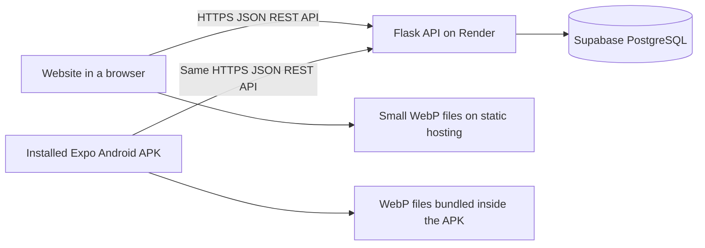

# Grove & Stone: Android and faster loading

## What runs where



**Flask is the framework; REST is the API design.** This project already has a REST API under `/api/v1`, shared by the website and Android app. Changing the framework alone would not fix large images or an idle server waking up. We keep the existing authentication, stock reservations and checkout transactions intact.

## Loading improvements

- The 13 bundled catalog PNGs totalled **24,796,922 bytes**. Their WebP replacements total **569,516 bytes**, a **97.7% reduction**. Originals remain available as source artwork.
- `tools/optimize_images.py` creates versioned WebP filenames and tiny Base64 previews. Full images are not embedded as Base64 in API responses. Base64 is an encoding, not compression; it normally adds roughly one third to binary size before transfer compression.
- Browser product photos use lazy loading and asynchronous decoding. Their versioned URLs come from the website's static assets, avoiding a request to the sleeping Flask service for each bundled fruit image.
- Android bundles these same optimized files in the APK. `expo-image` also caches remote images in memory and on disk. Newly supplied external image URLs continue to work; they should also be resized/compressed before publishing.
- Existing public `/api/v1/media/...` URLs now support a one-day browser cache and ETag revalidation. Private API responses remain `no-store`.
- Startup requests run together instead of first waiting for a health check and then shop configuration. Navigation opens immediately; each public response can appear as it arrives.
- Repeat visits restore a public catalog snapshot up to 24 hours old while refreshing it. A cache does not restore checkout permission or customer credentials. Orders require a live stock check and the backend still validates current prices, stock and delivery coverage.

These are file-size and behavior improvements, not a measured guarantee of a particular load time on every network. A browser visit with a warm API is different from one after Render has put the free server to sleep.

## Android build and installation

**[APK 1.0.0 download and installation guide](output/android/README.md)** — the signed EAS build succeeded and its downloaded archive passed integrity checks. It is not yet published on Google Play.

The app is owned by the Expo account `saispandanatumu`, project `grove-and-stone`. Its Android identifier is `com.groveandstone.app`; minimum Android version is 8.0 (API 26). EAS generates and holds the signing keystore. Keep access to that Expo account for future updates.

From the `mobile` directory:

```powershell
npm.cmd ci
npm.cmd run typecheck
npx.cmd eas-cli@latest login
npx.cmd eas-cli@latest build --platform android --profile preview
```

`preview` produces an **APK**, which can be installed on an Android phone from its EAS download page. Both build profiles explicitly use the deployed HTTPS API, so an installed app does not depend on a developer's laptop. `production` produces an **AAB** for Google Play submission:

```powershell
npx.cmd eas-cli@latest build --platform android --profile production
```

An Android JavaScript export is only one input to a native build; it is not an installable APK. The first native build exposed a missing splash drawable; the configuration now supplies an explicit image, and local prebuild verifies that all Android density variants exist.

First launch has three optional introduction cards and a delivery-pincode field. Session tokens use Android SecureStore. Custom links such as `groveandstone://p/alphonso-mangoes`, `groveandstone://mango-season`, and `groveandstone://order/ORDER_NUMBER` open the matching screens. Verified HTTPS app links require publishing the final signing certificate fingerprint separately.

For local native compilation, `npm.cmd run android` requires Android Studio/SDK, Java, and a connected device or emulator. EAS cloud builds do not require those tools on this computer. The repository-root `.easignore` restricts future uploads to the mobile source and excludes dependencies, local environment files, native build folders, and unused source artwork.

## Validation and remaining release work

- 52 backend tests passed, including public-image caching, conditional responses and private API cache isolation.
- TypeScript checks, web and Android exports passed.
- Catalog cache tests cover malformed, expired and future-dated snapshots.
- Local browser inspection confirmed loaded WebP images with `loading="lazy"` and static asset URLs.
- On 19 September 2026, APK 1.0.0 installed and launched on a Windows-hosted Android 11 x86_64 emulator with WHPX acceleration. The welcome screen, Skip action, home page, Cart navigation and repeat launch were checked; no crash was recorded during that check. [Windows launcher and setup](output/android/windows/README.md).
- Physical-phone testing remains: onboarding at different screen sizes, sign-in, product browsing, cart, back navigation and background/resume behavior. Emulator checks do not replace these checks.
- Live payments remain deferred at the owner's request. Firebase configuration and real push delivery, verified HTTPS app links, Google Play listing/policies and merchant setup must be completed before a public store release. See `OWNER_GUIDE.md` for operational launch requirements.

## Scaling beyond free hosting

Render Free can sleep when idle. Fast, consistent first requests require an always-on backend plan; no paid upgrade has been made. Before large-scale traffic, measure capacity and add shared rate-limit storage, background workers for alerts, production monitoring/backups, database migrations and appropriately sized database connections/workers. Do not describe this free deployment as load-tested for large-scale traffic.

References: [Expo Android APK builds](https://docs.expo.dev/build-reference/apk/), [Expo Image caching](https://docs.expo.dev/versions/v57.0.0/sdk/image/), [Base64 size](https://developer.mozilla.org/en-US/docs/Glossary/Base64), [Render Free limitations](https://render.com/docs/free).
