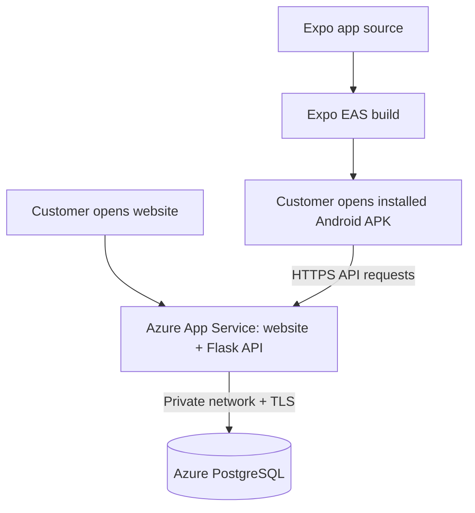

# Grove & Stone — Azure deployment for beginners

**Superseded:** the owner subsequently requested free hosting. Use [FREE_DEPLOYMENT.md](FREE_DEPLOYMENT.md) for the selected Render + Supabase + Expo setup. Do not create this guide's paid Azure resources for the current request. The Azure files remain an optional future alternative.

Updated 10 September 2026. **Azure is now the requested hosting provider, replacing the earlier Render plan. The destinations are a public website and an installable Android app.** Source/configuration is prepared; nothing has been deployed to Azure or built remotely in EAS. Azure sign-in succeeded for the owner's account. The portal's subscription list shows 0 of 0, and its directory list shows no other directory. Subscription activation/access, region/quota checks, and a cost decision are still needed.

## What “cloud” and “deployment” mean

Currently the shop runs on your computer. Turning off the computer stops it. A cloud provider supplies computers and managed services in its data centres. Deployment means uploading and configuring the project there so it can run independently of your laptop.

| Term | Plain meaning in this project |
| --- | --- |
| Microsoft account | Your sign-in identity. It can differ from the email used for Expo. |
| Azure subscription | The account container that determines billing/credits and which resources you can create. Signing in alone does not create a subscription. |
| Resource group | A named folder for the related cloud resources; proposed name `grove-and-stone-review`. |
| Region | Where the services run. Central India is the candidate; availability and subscription restrictions must be checked. |
| App Service | Runs Python/Flask and serves the exported website at a public HTTPS address. |
| App Service plan | The computing capacity charged for running App Service. Proposed Linux Basic B1, one instance. |
| PostgreSQL Flexible Server | Managed storage for products, customers, stock, baskets, and orders. Proposed B1ms, 32 GB, PostgreSQL 17. |
| Virtual network / private DNS | A private route and name lookup connecting Flask to PostgreSQL. The database has no public network access in this template. |
| HTTPS | Encrypted communication between website/app and the backend. Azure supplies a default website address and certificate. |
| Bicep | Microsoft's text format describing which Azure resources to create. It is a recipe, not a running deployment. |
| EAS | Expo's build service. It packages the Android app using the Azure API address. It does not host the database. |
| APK | Android installation file for direct testing. An AAB is a separate Google Play distribution format. |



The website and Android app use the same backend and database. An account or order created in one is available in the other after login. Five-second stock checks also use that shared backend. Closing your laptop will not stop a successfully deployed cloud service.

## What is prepared

Local verification: **41 backend tests passed**, including two new website-hosting tests. The Bicep template compiled with Microsoft's Bicep CLI 0.47.16. Expo produced the web export, and the actual exported HTML/JavaScript and nested screen URL were served through Flask in a local integration check. Missing API routes and source-file requests remained 404. These checks do not replace Azure-side validation or a real deployment test. One existing Firebase token deprecation warning remains.

| File | What it does |
| --- | --- |
| `infra/azure/main.bicep` | Creates App Service, its plan, PostgreSQL/database, virtual network, and private DNS. Forces HTTPS, disables FTP/basic publishing authentication and public database access. |
| `infra/azure/main.bicepparam` | Reads the database password and app signing secret from terminal environment variables into secure deployment parameters. |
| `infra/azure/package.py` | Exports the Expo website with the chosen API URL and packages backend, requirements, images, web files, and startup script. Does not upload anything. |
| `infra/azure/start.sh` | Creates missing database tables and starts Gunicorn on port 8000. Existing columns are not migrated. |
| `backend/web.py` | Serves the exported website and supports refreshing nested screen URLs. API errors/missing assets remain errors, and private/path-traversal files are not served. |
| `mobile/eas.json` | Existing internal APK and production AAB profiles. Both can point to Azure. |

One App Service hosts both website and API, so a separate static-site service is unnecessary for this setup. GitHub is useful for version history but is not required for the first ZIP deployment. The old Render files remain as historical alternatives; use this guide for Azure.

## Cost review before creating resources

This proposal is **not an always-free configuration**. Indicative Central India consumption rates retrieved from Microsoft's Retail Prices API on 10 September 2026:

| Resource | Reference rate | Example monthly amount |
| --- | --- | --- |
| App Service Basic B1 Linux | ₹1.7198/hour | ₹1,255.45 for 730 hours |
| PostgreSQL Flexible Server B1MS | ₹2.3409/hour | ₹1,708.86 for 730 hours |
| PostgreSQL storage | ₹12.5166/GB/month | ₹400.53 for 32 GB |
| Base subtotal | | **Approximately ₹3,365/month** |

Private DNS, applicable network/backup overages, taxes, optional integrations, and any EAS charges are additional. INR API prices are reference estimates; your agreement, credits, region, usage, and actual bill can differ. The portal's subscription-specific quote takes precedence. See [Microsoft's retail-pricing API explanation](https://learn.microsoft.com/en-us/rest/api/cost-management/retail-prices/azure-retail-prices) and [Azure Pricing Calculator](https://azure.microsoft.com/en-us/pricing/calculator/).

Before creating paid resources, confirm the subscription and acceptable budget. Student/free-account credits must be checked in that account, not assumed. Set a Cost Management budget alert in the portal; an alert is not an automatic spending cap. Stopping the website does not delete its paid App Service plan or the database storage. Never delete the resource group before exporting data you want to retain.

## Details needed from you

1. Sign into [Azure Portal](https://portal.azure.com/) in the accessible in-app browser. Enter passwords and MFA codes directly there.
2. Tell me the subscription name, such as Azure for Students, and whether the account is personal or controlled by your college/company. If no subscription is listed, tell me; account setup must finish first.
3. Confirm the region if your college/company requires one, and your permitted monthly budget or credits-only limit. The paid resource creation step waits for this decision.
4. Sign into Expo for the APK build. The configured Android identifier is `com.groveandstone.app` and app name is Grove & Stone.

No domain purchase is needed for the first review. Do not send passwords, payment details, database credentials, verification codes, or API secrets in chat.

## Deployment steps and commands

These commands are a reproducible guide. Commands that create/upload resources have **not** been run. Use PowerShell from the extracted Grove-and-Stone project root. Stop on any failed command; do not continue using missing outputs.

### 1. Install tools and sign in

Install Python, Node.js, and the official [Azure CLI for Windows](https://learn.microsoft.com/en-us/cli/azure/install-azure-cli-windows). Open a new terminal after installation.

```powershell
az version
az login
az account list --query "[].{Name:name,Id:id,State:state}" --output table
$subscription = Read-Host 'Subscription name or ID'
az account set --subscription $subscription
az account show --query '{Name:name,Id:id}' --output table
az bicep install
az webapp list-runtimes --os linux --output table
az postgres flexible-server list-skus --location centralindia --output table
```

Browser sign-in and CLI sign-in are separate. Complete the Azure CLI's own sign-in prompt when asked. Verify Python 3.14, PostgreSQL 17/B1ms, and B1 App Service are supported for the selected region/subscription. If restricted, revise the proposal before creating resources; do not silently upgrade to a costly size.

### 2. Review infrastructure

```powershell
$group = 'grove-and-stone-review'
$region = 'centralindia'
az group create --name $group --location $region --output none
```

This creates a resource-group container; the following infrastructure creation is the step that provisions billed services. Azure may require registration of Microsoft.Web, Microsoft.Network, and Microsoft.DBforPostgreSQL resource providers. An account administrator may need to enable them.

Choose a strong retained database password and signing secret, store them in your password manager, and enter them privately below. Database password must satisfy Azure complexity requirements and be at least 16 characters; signing secret at least 32 random characters. Reuse the same values for future infrastructure deployments to avoid unintentionally changing credentials or invalidating logins.

```powershell
$dbSecret = Read-Host 'Retained database password' -AsSecureString
$appSecret = Read-Host 'Retained random signing secret' -AsSecureString
$env:GS_AZURE_DB_PASSWORD = [System.Net.NetworkCredential]::new('', $dbSecret).Password
$env:GS_AZURE_SECRET_KEY = [System.Net.NetworkCredential]::new('', $appSecret).Password
az deployment group validate --resource-group $group --parameters infra/azure/main.bicepparam --output none
az deployment group what-if --resource-group $group --parameters infra/azure/main.bicepparam
```

`validate` checks the template against Azure; `what-if` previews intended changes. Neither is a price guarantee. Do not print the secret environment variables or save compiled parameter JSON containing them. The normal Bicep template itself has no embedded credentials.

### 3. Create resources after the account/cost decision

```powershell
try {
    az deployment group create --resource-group $group --name grove-stone --parameters infra/azure/main.bicepparam --output none
    if ($LASTEXITCODE -ne 0) { throw 'Azure provisioning failed; inspect the deployment before continuing.' }
} finally {
    Remove-Item Env:GS_AZURE_DB_PASSWORD, Env:GS_AZURE_SECRET_KEY -ErrorAction SilentlyContinue
    $dbSecret = $null
    $appSecret = $null
}
$deployment = az deployment group show --resource-group $group --name grove-stone --query properties.outputs --output json | ConvertFrom-Json
$appName = $deployment.appName.value
$websiteUrl = $deployment.websiteUrl.value
$apiUrl = $deployment.apiUrl.value
```

Provisioning creates the services; the website code is uploaded in the next step. A partial failure can leave some billed resources created. Inspect the deployment status before retrying. The settings recipe resets payment/contact to disabled on reapplication: review it before updating an existing live environment. Retain provider settings intentionally rather than blindly redeploying the preview recipe over production.

### 4. Build and upload the website/backend

```powershell
python -m venv .venv
.venv/Scripts/python.exe -m pip install -r requirements.txt
Push-Location mobile
npm.cmd ci
Pop-Location
.venv/Scripts/python.exe infra/azure/package.py --api-url $apiUrl
if ($LASTEXITCODE -ne 0) { throw 'Website packaging failed.' }
az webapp deploy --resource-group $group --name $appName --src-path .azure-build/app.zip --type zip
if ($LASTEXITCODE -ne 0) { throw 'App Service deployment failed.' }
Invoke-RestMethod "$apiUrl/health"
Start-Process $websiteUrl
```

Use a current Azure CLI supporting Microsoft Entra authentication for `webapp deploy`; the template disables basic publishing credentials. Do not enable FTP/basic authentication to work around an outdated CLI. App Service builds the Python environment from requirements, creates missing tables, and starts Flask. Allow the first startup to finish before health checks. Inspect App Service deployment logs if it fails.

The generated `.azure-build/app.zip` is the upload artifact. **Do not upload Grove-and-Stone.zip directly**: that source archive has an enclosing folder, developer documents, and no exported website. The local packaging test used `https://grove-stone-preview.example/api/v1` only as a placeholder; rebuild with the actual `$apiUrl` before upload.

No local customers, passwords, orders, addresses, or database are copied. The cloud database starts empty. Populate the approved catalog, banners, and delivery rules through the existing administrator APIs after creating a private administrator using the server-side Flask command. The local demo seed intentionally refuses remote databases. Do not remove that guard or import the local review account into a public service. Public sample content must be identified as a preview before enabling any order-taking.

### 5. Build the Android app against Azure

```powershell
Push-Location mobile
npx.cmd eas-cli@latest login
npx.cmd eas-cli@latest whoami
npx.cmd eas-cli@latest init
npx.cmd eas-cli@latest env:create --environment preview --name EXPO_PUBLIC_API_URL --value $apiUrl --visibility plaintext
npx.cmd eas-cli@latest build --platform android --profile preview
Pop-Location
```

Select your own Expo account/project. If a project is already linked, retain its identity rather than creating another. Update the existing environment variable in Expo if it already exists. The API URL is public, so plaintext visibility is appropriate; database/password secrets never belong in the app.

EAS builds and signs an APK. Open its resulting download link on your Android phone and install it for review. Account quota/plan determines included build usage; no paid upgrade is authorized automatically. Test login, browsing, cart, delivery, and stock against the Azure backend. An EAS bundle/export is not proof of a working installed APK. [Expo APK build guide](https://docs.expo.dev/build-reference/apk/).

Publishing to Google Play is separate and needs a developer account/store listing. An iOS app is outside this Android/web configuration and needs additional Apple setup.

## What still needs verification before calling it live

- Azure resource validation/provisioning, private PostgreSQL connectivity, and schema creation on the selected PostgreSQL 17 server. Local database tests use PostgreSQL 18.4.
- Public HTTPS website, nested-page refresh, product images, actual API URL, sign-in, cart, and stock checks.
- Approved cloud catalog and delivery data, without local review accounts or orders.
- Signed APK installed on a physical phone and tested against the same cloud database.
- Real commerce values/policies and provider test credentials. Online payments/contact are disabled in this recipe; real email, push, gateway callbacks, refunds, and fulfillment are not implied by deployment.
- A reliable refund/push worker before enabling those integrations. This template does not provision a worker. The single-process in-memory rate limiter is for review; scalable production requires shared storage. Review least-privilege database roles, secret management and recovery procedures before real customer use.

For product screens and shopping explanations, read [BEGINNER_GUIDE.md](BEGINNER_GUIDE.md). The original Render commands in [DEPLOYMENT.md](DEPLOYMENT.md) are now an alternative, not the current target.

## Technical references

- [Microsoft: Python on App Service](https://learn.microsoft.com/en-us/azure/app-service/configure-language-python)
- [Microsoft: ZIP deployment](https://learn.microsoft.com/en-us/azure/app-service/deploy-zip)
- [Microsoft: private PostgreSQL networking](https://learn.microsoft.com/en-us/azure/postgresql/flexible-server/concepts-networking-private)
- [Microsoft: installing Bicep](https://learn.microsoft.com/en-us/azure/azure-resource-manager/bicep/install)
