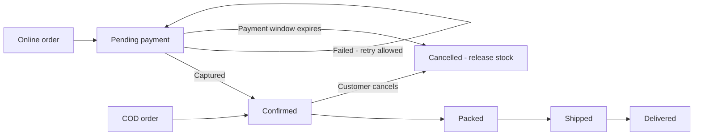
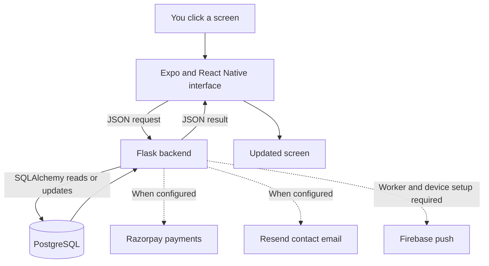
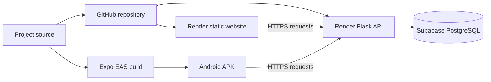

# Grove & Stone — a beginner's guide

**Latest hosting update (11 September 2026):** Render will host the website and Flask API, Supabase Free stores PostgreSQL data, and Expo EAS will build the Android APK. The private GitHub repository is connected and the 22 cloud database tables are initialized. The public website/API and signed APK remain pending. Read [the free deployment guide](FREE_DEPLOYMENT.md) for the remaining account and connection steps.

This guide assumes you have never built an app or website. It explains the shop, its screens and controls, the purchase flow, the technologies, and the code files.

Grove & Stone is an India-focused shop for **exotic fruits, dry fruits, and seasonal mangoes**. The documents define these three categories; they do not restrict the shop to the original four products. The design follows the supplied Foodwagon reference: yellow hero, orange buttons, product cards, and dark footer. The shop's brand remains Grove & Stone.

**Open the website: [http://localhost:8081/](http://localhost:8081/).** This is a local preview. `localhost` means this computer; it is not a public internet address. The database, Flask server, and Expo server must be running.

The catalog now contains 19 sample products and 38 packs. Prices, GST percentages, origins, inventory, delivery coverage, and harvest dates are review data. Generated pictures illustrate products; they are not photographs of a supplier's actual inventory. UPI/card payments in the local preview are simulations and charge nothing.

## Contents

- [Try a purchase](#try-a-purchase)
- [Website screens and controls](#website-screens-and-controls)
- [How the parts work together](#how-the-parts-work-together)
- [What each technology is used for](#what-each-technology-is-used-for)
- [Files and folders](#files-and-folders)
- [What the database stores](#what-the-database-stores)
- [The API explained](#the-api-explained)
- [Run the project](#run-the-project)
- [Tests and troubleshooting](#tests-and-troubleshooting)
- [Deployment and remaining work](#deployment-and-remaining-work)
- [Glossary](#glossary)

## Try a purchase

1. Open the local website. Select **Account**.
2. Log in with the local demo email `review@example.com` and password `GroveReview2026!`. This is a shop account, separate from your GitHub/Render/Expo accounts. Use these demo credentials only locally.
3. Open **Home → Dry fruits → California Almonds**. Select **250 g**, then **Add to cart**.
4. Open **Cart**. The sample pack costs ₹399, including ₹19.00 GST. GST is already inside the price and is not added again.
5. Select **Continue to checkout**. Enter an address and sample pincode `500001` (Hyderabad), `400001` (Mumbai), or `560001` (Bengaluru).
6. Select **Check delivery & total**. With the sample ₹49 delivery fee, this example totals ₹448. Sample free delivery starts at ₹999 subtotal.
7. Choose an available delivery day and **Cash on delivery**, **UPI**, or **CARD**. COD confirms the local order immediately. Online methods open the local payment simulator after you continue.
8. For an online example, select **Simulate failed payment**, then **Simulate successful payment**. No bank/card transaction occurs.
9. Review the order. Later open **Account → Orders → View [order number]**. Confirmed orders can be cancelled before packing. **Reorder** adds the items to a basket at today's prices; it does not pay automatically.

This demo does not arrange a real courier or deliver fruit. Real commerce also requires approved business values, actual inventory, configured payment providers, and staff fulfillment.

## Website screens and controls

### Shared navigation

| Element | Meaning and use |
| --- | --- |
| Top home/leaf/bag/person icon | Identifies the current main area instead of repeating its name as a heading. |
| Grove & Stone text | Brand label shown in the wider header. |
| **Deliver to** or a pincode | Opens the delivery checker. After selection, the six-digit pincode appears here. |
| Magnifying glass | Opens product search. |
| **Login** or your first name | Opens Account on wider screens. The bottom Account tab is always available. |
| Back arrow | Returns to the previous screen inside the current tab. |
| Bottom **Home**, **Mangoes**, **Cart**, **Account** | Switches between the four main areas. Each can contain detail screens. |
| Cart badge | Counts packs, not distinct products. Two strawberry packs and one almond pack show 3. |
| Notice at the top | Reports success, missing information, or a connection problem. The close icon dismisses it. |
| Faded/disabled button | The action cannot currently run, for example because stock is zero or a request is processing. |

### Home

| Element | What it does |
| --- | --- |
| Yellow hero | Large promotional area containing a title, description, image, and action button. Published backend banners supply this content. |
| Hero action button | Opens the mango season hub for mango slides; otherwise selects the collection and scrolls to products. |
| Slide dots | Selects a banner and pauses automatic slide changes. |
| Previous / next arrows | Move between banners and pause rotation, so you can read the selected promotion. |
| Play/pause icon | Controls automatic banner rotation. Slides change approximately every 6.5 seconds when enabled. Reduced-motion settings are respected. |
| Mango collection card | Shows how many mango varieties are in the catalog and opens the mango season hub. |
| Three hero collection shortcuts | Open the mango season hub or filter the exotic/dry-fruit product list. |
| Moving image | Decorative app animation; it does not affect products or the cart. |
| **Check pincode** | Opens delivery checking. |
| Three category pictures | Selects Exotic fruits, Dry fruits, or Mangoes. |
| Mango season strip | Displays a harvest/status summary. **Explore mango season** opens the Mangoes tab. |
| **This week** heading | Labels the collection. It does not automatically calculate weekly discounts. |
| **All products** and category filter buttons | Chooses which cards appear. |
| Product image/name | Opens that product's details. |
| Origin, pack, price | Shows the supplied source location and default purchasable pack. |
| Heart | Adds/removes a wishlist item. Guests are directed to login. A wishlist does not reserve inventory. |
| **Add to cart** on a card | Adds one default pack. Open product details to choose another pack. |
| **Notify me** on a seasonal card | Opens an available mango waitlist. It does not take payment. |
| **How does it work?** strip | Informational steps: location, products, basket, receiving the order. |
| Dark footer | Opens About, Shipping, Returns, Contact, and FAQ. The sample-preview label identifies demonstration content. |

The current banners promote collections. There is no coupon/discount engine. A new arrival or offer can be advertised by editing banner content, but a displayed offer also needs matching business/pricing implementation.

| Category | Sample products |
| --- | --- |
| Exotic fruits — 8 | Dragon Fruit, Green Kiwi, Strawberries, Blueberries, Avocado, Passion Fruit, Lychee, Pears |
| Dry fruits — 3 | California Almonds, Whole Cashews, Pistachios |
| Mangoes — 4 | Alphonso, Kesar, Langra, Dasheri |

Alphonso is a live sample; Kesar, Langra, and Dasheri are upcoming samples. Sample harvest windows demonstrate functionality and do not describe the actual current harvest season.

### Search and product details

| Element | What it does |
| --- | --- |
| Search field and **Search** | Looks for active products by name, origin, or linked mango variety. Try `blueberries` or `Goa`. Blank/overlong input gets an explanation. |
| No-results message | Suggests trying another search when nothing matches. |
| Product picture, name, description, origin | Introduces the selected product. |
| **Choose your pack** | Selects a size with its own price, GST, stock, and COD eligibility. |
| Price and GST text | Displays the selected pack's tax-inclusive price and configured tax percentage. |
| Available count | Shows the latest known number of this pack in stock. |
| **Add to cart** | Adds one selected pack. It is disabled when the product/pack cannot be purchased. |
| **Notify me** | Offered for an unavailable mango variety accepting registrations. |
| Ripeness and handling notes | Instructions for receiving, ripening, and storing the product when supplied. |

A **product** is the fruit itself. A **variant** is a purchasable pack: Strawberries is a product; 250 g and 500 g are two variants. Mangoes use boxes of 6 and 12 pieces.

### Stock checks

| Label/control | Meaning |
| --- | --- |
| **In stock** | The default pack is purchasable and has more than five available. |
| **Only N packs left** | Five or fewer default packs remain. |
| **Unavailable now** / **Currently unavailable** | No selected/default stock, or active/season rules prevent purchasing. |
| **Stock updates every 5 seconds** | The app periodically asks the server for current stock. This is near-real-time polling, not an instant socket connection. |
| **Check stock now** | Requests an immediate refresh. |
| Stale-stock/connection notice | A check failed; previously displayed quantities may be outdated. Retries happen automatically. |
| Cart/checkout shortage warning | Reduce quantity or remove an unavailable item before proceeding. |

Checks cover visible lists/product details and basket items. They pause in the background and resume on return. Failures retry with increasing delays. The server checks stock again when adding and ordering, protecting against purchases made between screen refreshes.

**A cart does not reserve stock.** Placing an order does. An unpaid online order normally reserves it for 30 minutes. Cancellation/expiry releases the recorded reservation once. The screen does not silently remove basket items or change their stored cart price during stock refresh.

### Mangoes and waitlist

| Element | What it does |
| --- | --- |
| Variety cards | Show variety, harvest dates, and live/upcoming/closed status. |
| **Shop [variety]** | Opens a live variety's product page. |
| **Notify me about [variety]** | Opens a variety accepting waitlist entries. |
| Waitlist picture/origin/dates | Confirms the variety being requested. |
| Full name | Optional; 2–80 characters if supplied. |
| Email/mobile | Supply a valid email, a 10-digit mobile number, or both. |
| **Notify me** / **Saving…** | Submits the contact and disables repeated clicks while processing. |
| Success message | Confirms registration. Repeated contact/variety submissions succeed without creating duplicates or exposing existing contacts. |
| **Mango season** | Returns to the Mangoes area. |
| **Shop this variety** | Appears when the loaded season is live and opens product details. |

Signed-in details prefill a newly opened form. Guests can register too. This feature currently **captures interest**; email/SMS harvest-alert delivery is not implemented. Registering does not reserve stock, make a deposit, or mean a notification has been sent. Firebase push delivery is a separate integration requiring configuration and device setup.

### Account

| Element | What it does |
| --- | --- |
| **New here? Create account** | Switches to registration. |
| Registration fields | Name, valid email, 10-digit mobile, and password with at least 8 characters. |
| **Create account** | Creates a shop customer, signs them in, and merges their guest cart. |
| **Already a member? Log in** | Returns to the existing-account form. |
| Email/password and **Log in** | Signs into an existing shop account. Phone OTP login is not implemented. |
| **Profile** and **Save details** | Edit name/mobile. Email is read-only in the current UI. |
| **Wishlist (N)** | View saved products, remove a heart, open a product, or add a pack. |
| **Orders** | View order numbers, dates, totals, and statuses. **View [number]** opens details. |
| **Reorder** | Adds previous items to the current basket using current price/stock. It does not place or pay for another order. |
| **Log out** | Revokes this login session. Stored customer cart, wishlist, and orders remain for the next login. |

Password reset, social login, email verification, phone OTP, a standalone saved-address management screen, and a notification inbox screen are not implemented. Some address/notification operations exist as API endpoints; that is different from having a corresponding screen.

### Cart and pincode

| Element | What it does |
| --- | --- |
| Product line | Shows product, pack, unit price, quantity, available stock, and line total. |
| Minus/plus | Changes quantity within available stock and the 20-per-line limit. Use Remove for the final pack. |
| Trash icon | Removes that basket line. |
| **Clear cart** | Opens confirmation: **Yes, clear cart** removes all lines; **Keep items** leaves them. |
| **Continue shopping** / **Find your favourites** | Opens the Home tab. |
| Subtotal | Sum of unit price multiplied by quantity for each line. |
| Included GST | Tax already inside those prices, not an extra charge. |
| Delivery: At checkout | Exact shipping is calculated after coverage checking. |
| Total before delivery | Basket amount before shipping. |
| **Check delivery pincode** / **Delivery to [pincode]** | Opens the delivery checker. |
| Pincode field and **Check availability** | Checks a six-digit postal code and updates the cart's selected pincode when valid. Unknown areas show unavailable coverage. |
| **Log in to check out** | Sends guests through login and into checkout. |
| **Continue to checkout** | Opens address, delivery-day, and payment selection. Shortages disable it. Eligibility is checked again during quoting/ordering. |

Example: two ₹399 almond packs total ₹798, with ₹38 GST already included. Adding sample ₹49 delivery gives ₹847. Shipping fee and free-delivery threshold are configurable business settings.

### Checkout

| Element | What to enter or expect |
| --- | --- |
| Saved-address buttons | Select an existing account address. |
| **Use a new address** | Starts another delivery address. |
| Full name/mobile | Recipient and 10-digit contact number. |
| Address line 1 | Required house/flat, building, and street. |
| Address line 2 | Optional additional address information. |
| Delivery pincode | Six digits; changing it clears the old quote. |
| **Check delivery & total** | Rechecks prices, stock, coverage, fresh-fruit rules, and delivery fees. |
| City and state/union territory | Delivery location. Check the pincode to load available state choices. |
| Landmark | Optional nearby place to help locate the address. |
| **Home**, **Office**, **Other** | Labels the address type. |
| **Save address to account** | Saves a new address after quoting. Changing an existing selected address creates a new record when saved; this screen does not edit/delete existing saved records. |
| Delivery-day buttons | Allowed dates based on the pincode's minimum delivery time, within the next 14 days. |
| Delivery notes | Optional instructions, up to 200 characters. |
| **UPI**, **CARD**, **Cash on delivery** | Chooses payment. COD needs pack and pincode eligibility. Online choices are hidden when online payments are disabled. |
| **Your order** | Pack/quantity/item totals, included GST, shipping, and final amount. |
| **Refresh total** | Loads a new quote. Review changes before ordering. |
| **Place order · ₹…** | Creates a COD order after backend validation. |
| **Continue to payment · ₹…** | Creates/resumes an online order and opens payment. |
| **Review cart** | Appears on a stock shortage and returns to the basket. |

The backend decides prices. Editing a number in the browser cannot set the backend's price. A unique checkout attempt ID helps recover a lost response without placing the same order twice.

### Order, payment, cancellation

| Element | What it does |
| --- | --- |
| GS- order number | Permanent reference for this purchase. |
| Heading and progress steps | Show confirmed → packed → shipped → delivered. This is a recorded status, not courier GPS. |
| Date/payment line | Shows selected delivery date and recorded payment method/status. |
| **Simulate successful/failed payment** | Local-only tests. Failure can be retried while the payment window remains open. No charge occurs. |
| **Open secure payment** | Opens hosted checkout when a real gateway is configured. Card details are not stored by this app. |
| **Refresh order status** | Reads current server status. Pending-payment screens also refresh automatically. |
| **Cancel order** | Available while confirmed, before packing. Confirm with **Yes, cancel order** or dismiss with **Keep order**. |
| Refund label | Distinguishes requested from processed. Requested does not mean money has been returned. |
| Order lines/address | Snapshots from purchase time. Catalog edits do not rewrite old orders. |
| **Continue shopping** / **My orders** | Opens Home or Account → Orders. |



Paid cancellation queues a refund. Late payment after expiry is handled separately rather than reopening an expired order. Refund delivery requires its worker/provider setup.

### Footer and support

| Page/control | What it does |
| --- | --- |
| **About** | Describes the shop and categories. |
| **Shipping** | Explains coverage, dates, and configured fees. |
| **Returns** | Describes the draft quality/returns process. **Contact us** opens Contact. |
| Contact fields | Name, email, optional mobile/order number, and message. |
| **Send message** | Validates submission. The local demo explicitly sends no email. Real sending needs Resend configuration. |
| FAQ search | Filters common questions by your words. |
| FAQ question buttons | Expand/collapse answers. |
| Page navigation buttons | Switch About/Shipping/Returns/Contact/FAQ. |
| **Reload support details** | Retries failed loading of shop settings. |

The sample quality-report window is 24 hours. Business policies still need owner approval before a real launch. Contact submissions are not stored as support tickets in this database.

## How the parts work together

The interface is the shop counter, the backend is the staff checking rules, and the database is the shop's organized records.



**Add to cart:** the screen sends a pack ID and quantity. Flask checks stock/season/active status, gets the server price, saves the basket line, and returns the new basket. The screen updates its count and totals.

**Checkout:** Flask checks the quote and delivery rules, reserves inventory, saves the order's price/address snapshots, and starts payment. Related database writes are one transaction: either they succeed together or roll back. This protects the final pack when two customers order simultaneously.

**Login:** Flask checks the password against its stored hash and issues session tokens. The app sends an access token with customer requests. A refresh token renews it after expiry. Logout revokes that session. A token is temporary login proof, not the password.

**Live stock:** the app periodically asks for current quantities and updates labels/controls. Checkout still performs its own final checks.

## What each technology is used for

| Technology | Simple explanation | Used in |
| --- | --- | --- |
| React | Builds screens from reusable pieces called components. | All interface screens. |
| React Native | Supplies mobile components such as Text, View, Image, ScrollView. | `mobile/`. |
| React Native Web | Lets these components run in a browser. | Local website preview. |
| Expo | Starts, bundles, and configures the React Native app. | `app.json`, Expo commands. |
| TypeScript | JavaScript with expected-data-type checks. | `.ts` and `.tsx` files. |
| React Navigation | Tabs, detail screens, back actions. | `mobile/App.tsx`. |
| Python | Language used for server rules. | `backend/`. |
| Flask | Receives API requests and returns JSON. | Backend app/routes. |
| SQLAlchemy | Maps Python classes to tables and queries/updates records. | Models and database operations. |
| PostgreSQL | Persistent products, accounts, baskets, orders, stock. | Separate database server. |
| psycopg | Connects Python to PostgreSQL. | Backend connection. |
| AsyncStorage | Small local values, such as guest and checkout attempt IDs. | API/session and checkout code. |
| SecureStore | Native authentication-token storage; web uses sessionStorage. | `api.ts`. |
| Firebase Cloud Messaging | Push notifications to configured devices. | Backend adapter/outbox; real device setup remains. |
| Razorpay | Hosted UPI/card payments when configured. | Payment integration. |
| Resend | Sends contact email through HTTPS when configured. | Support form backend. |
| Gunicorn | Production Flask server on Linux. | Render startup/`wsgi.py`. |
| Git / GitHub | Tracks source versions / hosts the remote repository. | Deployment source workflow. |
| Render | Hosts the website and Flask API remotely. Supabase hosts PostgreSQL. | `render.yaml`. |
| EAS | Expo cloud service building APK/AAB packages. | `mobile/eas.json`. |
| pytest | Runs backend checks automatically. | `backend/tests/`. |

## Files and folders

The portable ZIP is **Grove-and-Stone.zip**, containing **Grove-and-Stone/**. In this workspace, editable deliverables are in `outputs/grove-and-stone/`. The separate `work/` folder holds this computer's runtime dependencies/test database and is excluded from the ZIP.

```text
Grove-and-Stone/
  README.md                 Entry point
  BEGINNER_GUIDE.md          This screen-by-screen explanation
  DEVELOPMENT.md            Detailed setup/developer commands
  DEPLOYMENT.md             Render and EAS steps
  CATALOG_REVIEW.md          Latest changes and test evidence
  ASSETS.md                 Image sources and generation prompts
  docs/                     Requirements and screen specifications
  backend/                  Flask and database code
  mobile/                   Website and Android interface
  render.yaml               Hosting recipe
  requirements.txt          Production Python dependencies
  wsgi.py                   Production backend entry point
  .env.example              Sample settings, not real secrets
```

| File | Responsibility / what to change here |
| --- | --- |
| `mobile/App.tsx` | Tabs, screen registration, header, theme, cart badge. |
| `mobile/src/Hero.tsx` | Animated four-slide hero, controls, mango feature and collection shortcuts. |
| `mobile/src/Home.tsx` | Categories, cards, search, product details, mango hub, waitlist. |
| `mobile/src/Account.tsx` | Registration/login, profile, wishlist, orders, reorder. |
| `mobile/src/Cart.tsx` | Basket and pincode interface. |
| `mobile/src/Checkout.tsx` | Address, quote, dates, payment, order confirmation/details. |
| `mobile/src/Info.tsx` | About, Shipping, Returns, Contact, FAQ. |
| `mobile/src/ui.tsx` | Shared buttons, fields, images, colors, spacing, money formatting. |
| `mobile/src/Store.tsx` | Shared customer/catalog/basket/wishlist state and actions. |
| `mobile/src/api.ts` | API URL, JSON requests, authentication tokens, data types. |
| `mobile/src/stock.ts` | Polling, subscriptions, retries, background pausing. |
| `mobile/src/StockStatus.tsx` | Stock status and manual-refresh button. |
| `mobile/assets/catalog/` | Product/hero images served by Flask. Keep with deployment. |
| `mobile/package.json` / `package-lock.json` | App libraries/commands and exact resolved library versions. |
| `mobile/app.json` / `eas.json` | App identity/platform settings and cloud build profiles. |
| `backend/__init__.py` | Creates/configures Flask and registers routes/commands. |
| `backend/web.py` | Optional hosting of the exported website beside the Flask API, used by Azure. |
| `infra/azure/` | Azure resource recipe, secure parameter inputs, website packaging, and startup script. |
| `backend/extensions.py` | Shared SQLAlchemy database instance used by the app and models. |
| `backend/requirements*.txt` | Backend libraries: core runtime, development/tests, and optional Firebase support. |
| `backend/models.py` | Defines the 22 database tables and relationships. |
| `backend/schema.sql` | Initial schema export, not a database-upgrade script. |
| `backend/schema_invariants.py` | Additional database consistency rules. |
| `backend/api.py` | Shared JSON conversion, validation, errors, pagination, transactions. |
| `backend/auth.py` | Login/signup/refresh/logout and permission checks. |
| `backend/catalog.py` | Product/search/admin catalog and stock snapshot API. |
| `backend/carts.py` | Cart ownership, quantity, prices, coverage, availability. |
| `backend/customers.py` | Profile, addresses, device registration, notification inbox API. |
| `backend/checkout.py` | Quote, order placement, reservations, cancellation, retry recovery. |
| `backend/payments.py` | Payment routes, hosted checkout, callbacks, demo payment. |
| `backend/admin.py` | Staff inventory/coverage/campaign/fulfillment APIs and public waitlist. |
| `backend/storefront.py` | Banners, images, wishlist, reorder. |
| `backend/content.py` | Health, support settings, contact. |
| `backend/notifications.py` | Notification queue, Firebase adapter, push worker. |
| `backend/demo_seed.py` | Repeatable local sample catalog. Keeps existing IDs/stock and corrects the old demo mango weight packs to boxes. Refuses remote databases. |
| `backend/tests/` | Automated validation, ownership, inventory, payment, and other checks. |

The original field definitions are in `docs/00-object-dictionary.md`. Other documents describe customer/admin/mobile screens. Older review files are historical checkpoints; a feature described as unfinished there may have since been completed. Use the latest catalog review for current status.

## What the database stores

A **table** resembles a structured spreadsheet. A **row** represents one thing. An **ID** links related rows reliably even when names change.

| Model | One record represents / purpose |
| --- | --- |
| Customer | One shopper account/profile; owns cart, wishlist, orders. |
| PincodeService | Delivery coverage, perishable/COD rules, estimated days for a postal code. |
| Address | A reusable saved customer delivery address. |
| Product | Fruit listing: category, name, origin, images, descriptions, season. |
| Variant | Purchasable pack: SKU, quantity/weight, price, GST, stock, COD. |
| WishlistItem | A customer saving a product without reserving it. |
| Cart | One guest/customer basket. |
| CartLine | One pack, quantity, and price snapshot in the basket. |
| MangoSeason | Variety campaign with harvest dates/status/waitlist setting. |
| WaitlistEntry | Email/mobile interest in a mango variety. |
| Order | One purchase, its totals, address snapshot, date, and status. |
| OrderLine | Purchased name/pack/SKU/quantity/price snapshot. |
| Payment | Payment amount, reference, and status. |
| CheckoutSession | Checkout attempt, payment metadata, expiry/retry recovery. |
| StockReservation | Quantity held for an order and whether it was released. |
| RefundRequest | Refund required and its processing status. |
| AdminUser | Staff account with admin/packer role. |
| CMSBanner | Scheduled promotional banner. |
| DeviceToken | Registered Android notification destination/permission. |
| PushMessage | Saved notification/inbox content. |
| AuthSession | Revocable login/refresh session. |
| PushDelivery | Queued notification send and retry outcome. |

One product can have many variants; one customer can have many orders; one order can have many lines. The original dictionary objects/enums remain, with documented wishlist/infrastructure additions. Passwords are hashes, not plain text. Card numbers/CVVs are not stored.

## The API explained

An API is how one program asks another to do a job. An **endpoint** is a particular request address, usually for code rather than a webpage for shoppers. Local endpoints start with `http://localhost:5000/api/v1`.

**GET** reads; **POST** submits/starts an action; **PATCH** changes selected fields; **PUT** sets/replaces; **DELETE** removes a supported item. For example, `GET /products` reads products and `POST /cart/lines` adds a pack.

| Action | Endpoint after `/api/v1` |
| --- | --- |
| Server health | GET `/health` |
| Catalog/search/detail | GET `/products`, `/search?q=blueberries`, `/products/{slug}` |
| Pictures/hero | GET `/media/{filename}`, `/banners` |
| Stock snapshot | POST `/stock/check` |
| Mango hub/waitlist | GET `/mango-season`; POST `/mango-season/waitlist` |
| Customer registration/login/refresh/logout | POST `/auth/signup`, `/auth/login`, `/auth/refresh`, `/auth/logout` |
| Profile | GET/PATCH `/me` |
| Wishlist | GET `/me/wishlist`; PUT/DELETE `/me/wishlist/{product_id}` |
| Cart items | GET `/cart`; POST `/cart/lines`; PATCH/DELETE `/cart/lines/{id}`; DELETE `/cart/lines` |
| Coverage/selected pincode | GET `/pincodes/{pincode}`; PUT `/cart/pincode` |
| Addresses | GET/POST `/me/addresses`; PATCH/DELETE `/me/addresses/{id}` |
| Quote/place/recover | POST `/checkout/quote`, `/checkout`; GET `/checkout/attempts/{request_id}` |
| Order history/detail | GET `/orders`, `/orders/{number}` |
| Cancel/reorder | POST `/orders/{number}/cancel`, `/orders/{number}/reorder` |
| Local payment | POST `/orders/{number}/demo-payment` |
| Real provider flow | POST `/orders/{number}/payment-session`, `/payments/callback`, `/payments/gateway-webhook` |
| Shop details/contact | GET `/shop-info`; POST `/contact` |
| Staff operations | `/admin/products`, `/admin/inventory`, `/admin/pincodes`, `/admin/mango-seasons`, `/admin/cms/banner`, `/admin/orders`, `/admin/dashboard` with staff authorization. |

Responses use **JSON**, labeled data such as `{"status":"ok"}`. Money uses decimal strings. Errors include a code, readable message, and field details. Customer and admin tokens are separate. Removing a product normally means setting `is_active=false`, preserving order history.

## Run the project

### Current computer

| Service | Address | Role |
| --- | --- | --- |
| Expo website | `http://localhost:8081/` | Interface. |
| Flask | `http://localhost:5000/api/v1/health` | Rules/data; the health address shows JSON. |
| PostgreSQL | `127.0.0.1:55440` | This workspace's database port, not a webpage. |

Sleeping/restarting the computer can stop the preview. Source files being saved does not mean servers are running. Restarting servers does not normally erase the database.

### A fresh computer or extracted ZIP

Use [DEVELOPMENT.md](DEVELOPMENT.md) for exact PowerShell commands. The order is:

1. Install Python, Node.js/npm, and PostgreSQL.
2. Open a terminal in the extracted project folder. A terminal accepts typed commands; `Set-Location` changes its working folder.
3. Create a Python virtual environment and install backend requirements. A virtual environment isolates this project's Python libraries.
4. Create PostgreSQL databases, then configure `DATABASE_URL`, `SECRET_KEY`, and CORS as described in DEVELOPMENT.md.
5. Run the environment's `flask --app backend init-db`, then start Flask. `init-db` creates missing tables; it does not upgrade existing columns.
6. For optional samples, use the separate loopback `grove_stone_local` database and the environment's `python -m backend.demo_seed --confirm-local-demo`. The seed refuses a remote database.
7. In a second terminal inside `mobile/`, run `npm.cmd ci`, then `npm.cmd run web`.
8. Visit `http://localhost:8081/` and keep the servers running.

Use the complete virtual-environment commands in DEVELOPMENT.md, not unconfigured Python/Flask shortcuts. Checked runtimes: Python 3.14.7, PostgreSQL 18.4, Node.js 24.20.0, Expo SDK 57, React Native 0.86.

### Settings

An **environment variable** is a setting provided when a program starts. `.env.example` is a reference and is not automatically loaded. Never put real credentials in the source/ZIP.

| Setting | Purpose |
| --- | --- |
| `DATABASE_URL` | Database location and connection credentials. |
| `SECRET_KEY` | Private backend signing secret; retain between restarts. |
| `CORS_ORIGINS` | Website origins allowed to call Flask. An origin includes protocol, hostname, and port. |
| `EXPO_PUBLIC_API_URL` | Public app setting pointing to Flask, including `/api/v1`; never include secrets. |
| `SHIPPING_FEE` / `FREE_SHIPPING_THRESHOLD` | INR delivery fee/free-delivery threshold; local samples 49/999. |
| `PAYMENT_BACKEND` | Allowed local `demo`, `disabled`, or configured `razorpay`. |
| `CONTACT_BACKEND` | Local `demo`, `disabled`, or configured `resend`. |
| Provider credentials | Private Razorpay/Firebase/Resend settings supplied securely when those integrations are configured. |

On a physical phone, `localhost` refers to the phone. Use the computer's LAN API address and the same network for local phone testing, or a deployed HTTPS API. [mobile/README.md](mobile/README.md) has the commands. Browser review does not verify native Android behavior.

## Tests and troubleshooting

**39 backend tests passed.** TypeScript checking and Android bundle export passed. The 57 earlier standalone schema checks apply to the unchanged schema. A bundle export is not a signed APK.

Tests cover accounts/roles, refresh/revocation, cart merging, included GST, quantities, competing checkouts, delivery rules, ownership, signed payment callbacks, expiry/cancellation, wishlist/reorder, repeatable seeding, and concurrent/duplicate waitlists. External sends are mocked.

Browser checks exercised categories, hero controls, pack selection, wishlist, login, waitlist validation/duplicates, cart quantities, saved-address totals, payment choices, simulated payment failure/success, cancellation, reorder navigation, and automatic stock blocking/restoration. See [CATALOG_REVIEW.md](CATALOG_REVIEW.md) for the latest evidence and limits. Prior FAQ/contact browser checks are recorded in CHECKOUT_REVIEW.md.

| Problem | Likely cause / next action |
| --- | --- |
| Site cannot be reached | Start Expo and check port 8081, then reload. |
| Shop cannot load / cannot reach shop | Check Flask health, PostgreSQL, API URL, and network; retry. |
| Empty catalog | Check which database is connected; use local demo seeding or authorized admin catalog creation. |
| Product unavailable | Select another pack/product or use Notify me where available. |
| Pincode not serviceable | Use configured coverage; local sample pincodes are above. |
| COD missing | Check pincode and pack eligibility. |
| Save address disabled | Load a quote, enter a new address if needed, and wait for any request to finish. |
| Session expired | The app normally refreshes access; log in again when asked. |
| Contact says no email sent | Expected in local demo mode. Configure Resend for real sending. |
| Refund still requested | Worker/provider has not confirmed processing. |
| Code change does not appear | Confirm the running folder, then reload/restart Expo. This workspace runs `work/mobile`, synchronized from `outputs/grove-and-stone/mobile`. |
| Test data disappears | Integration tests clear their separate disposable test database. Never aim them at review/live data. |

An existing Firebase-token deprecation and development style warnings are documented; a warning is not automatically a failed feature. Dependency advisories and physical-device/provider testing remain outstanding.

## Deployment and remaining work

**Local** means this computer. **Deployed** means remotely hosted. **Building an APK** packages Android for installation; that does not deploy Flask or publish a website.



| Prepared file | Purpose |
| --- | --- |
| `render.yaml` | Recipe for the Free Render API and static website; does not deploy simply by existing. |
| `requirements.txt` | Production Python dependency entry point. |
| `wsgi.py` | Supplies the Flask app to Gunicorn. |
| `mobile/eas.json` | Internal preview APK and production AAB build profiles. |
| `FREE_DEPLOYMENT.md` | Current commands, dashboard steps and deployment status. |

Your deployment approval is recorded. GitHub and Render are connected, and the repository is private. Supabase has all 22 application tables with row-level security enabled; its automatic Data API is disabled because the app uses Flask for access. The Render form needs your private Supabase database connection string. Enter it on Render, never in chat or GitHub.

The current Render recipe includes **both the API and website** as separate services. Once created, their actual HTTPS addresses must be connected in the settings and tested. The Android APK will use that same API. Expo's command-line build tool still needs account sign-in; signing into its website alone does not sign that tool in.

We are using Supabase Free for the database, avoiding Render's expiring database trial. Render's free API sleeps while idle, and inactive Supabase Free projects can pause. See [FREE_DEPLOYMENT.md](FREE_DEPLOYMENT.md) for the limits and what a slow first visit means.

Before a real launch: finish the hosting connection and Expo sign-in; arrange backups and a push/refund worker; replace sample catalog/business values; configure/test real payments, email, and push; test an installed Android build. A separate staff website, phone OTP/social login, waitlist email/SMS delivery, and public web deployment are not complete. Administrative JSON endpoints exist, but there is no finished visual staff dashboard.

## Glossary

| Word | Meaning |
| --- | --- |
| Frontend / backend | Visible interface / server applying rules and handling requests. |
| Database | Persistent organized records. |
| Component / state | Reusable interface piece / information the running app currently holds. |
| API / endpoint | Program interface / specific request address. |
| JSON | Text format for labeled data. |
| Model / schema | Definitions of records, tables, and rules. |
| Relationship | Link between records, such as customer → orders. |
| Constraint / enum | Data rule / fixed allowed-value list. |
| Variant / SKU | Purchasable pack / stock-keeping reference code. |
| Authentication / authorization | Proving identity / checking allowed actions. |
| Token / session | Temporary login proof / server record of login. |
| Transaction | Database changes that succeed/fail together. |
| Polling / webhook | Repeated update requests / an external provider delivering an event. |
| Mock / demo | Test substitute for the real external action. |
| Dependency | Library/package the code uses. |
| Build / deploy | Package software / run it remotely. |
| Repository | Version-tracked source files. |
| APK / AAB | Android installation package / store-distribution bundle. |
| CORS | Browser rules controlling which website origins can call the API. |

Continue with [DEVELOPMENT.md](DEVELOPMENT.md) for setup, [DEPLOYMENT.md](DEPLOYMENT.md) for hosting/build commands, and [CATALOG_REVIEW.md](CATALOG_REVIEW.md) for the latest catalog/debugging results.
