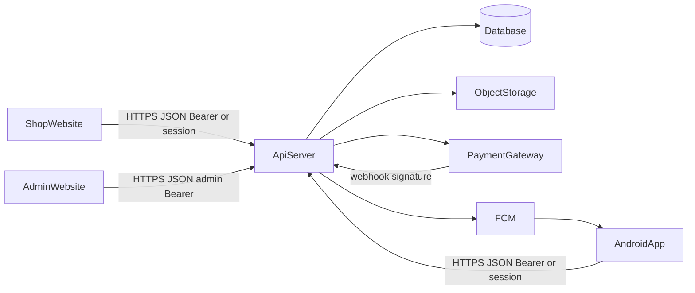
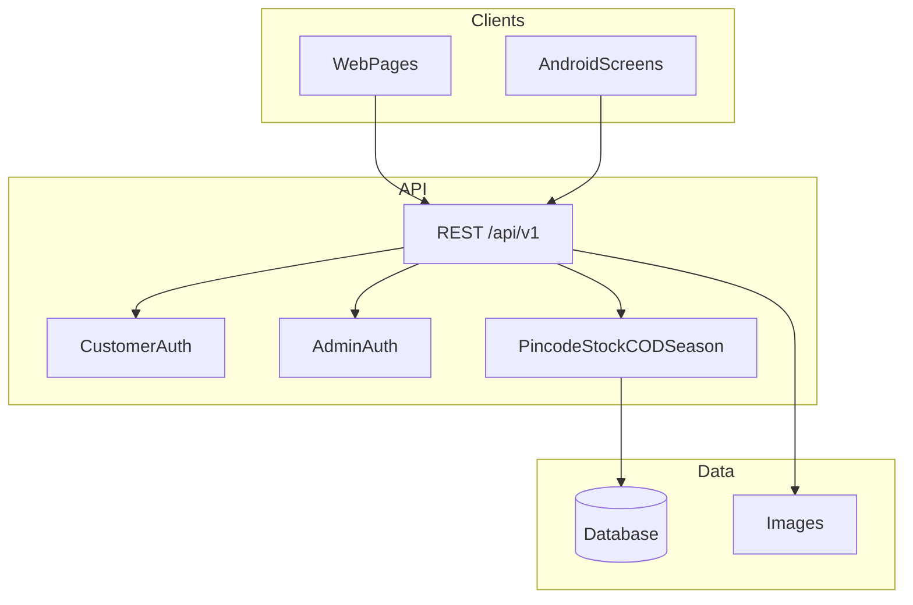
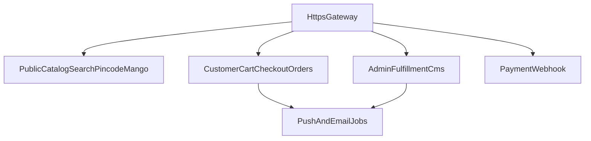
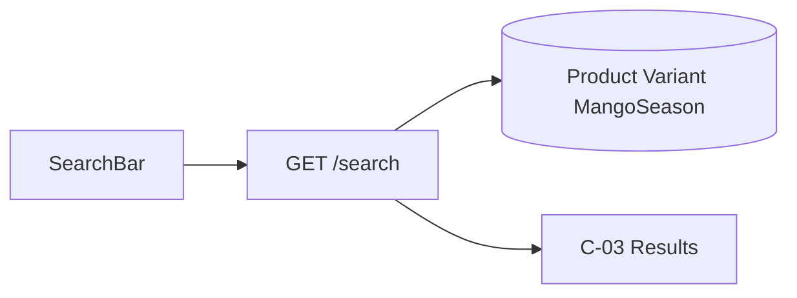
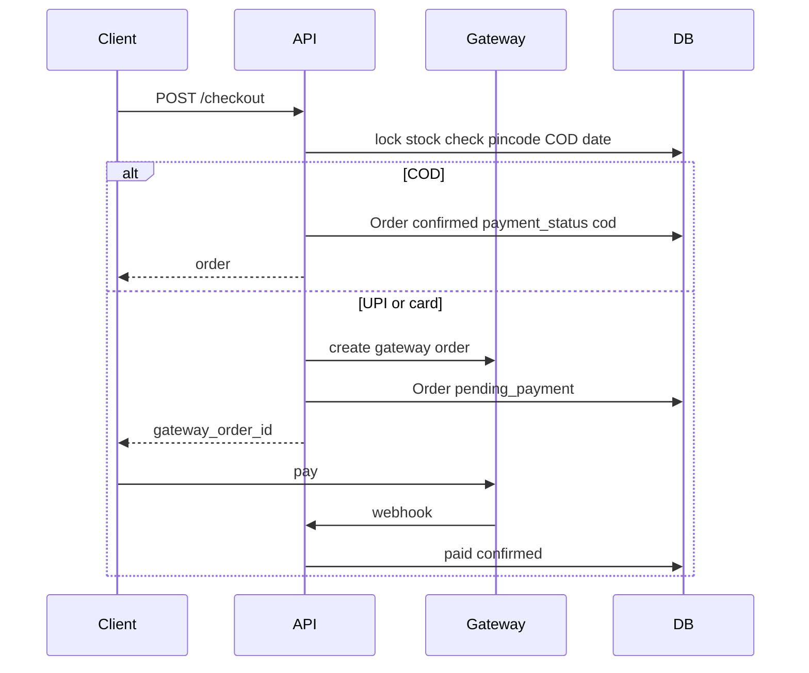

# Architecture

Logical architecture for Grove & Stone. **Not implemented in this repo** — this is the target shape. Stack (Django, Node, etc.) is not fixed.

**Clients:** website shop + website admin + Android app  
**Contract:** [API.md](API.md) · [BACKEND.md](BACKEND.md)  
**Data:** [00-object-dictionary.md](00-object-dictionary.md)  
**Search:** [SEARCH.md](SEARCH.md)

---

## 1. System context

Three clients, one backend, one catalog. Payment cards never touch our servers. Android push goes through FCM.

| Component | Responsibility |
| --- | --- |
| Shop website | C-01–C-21; public + customer API |
| Admin website | A-01–A-09; admin API only |
| Android app | Same shop APIs + DeviceToken; no admin |
| API server | Auth, catalog, search, cart, checkout, pincode, mango CMS, jobs |
| Database | All objects in the dictionary |
| Object storage | Product and CMS images |
| Payment gateway | UPI/card collect; webhook to mark paid |
| FCM | Order and mango-season pushes |

---

## 2. Client vs server

- **UI** owns layout (screen MD files). It does not compute price, GST, COD eligibility, or mango pincode rules.  
- **API** owns those rules so web and Android cannot diverge.  
- **Guest cart** is keyed by `X-Session-Id`; after login, session cart **merges** into the Customer cart.  
- **Search** runs on `GET /search`, not only in the browser ([SEARCH.md](SEARCH.md)).

---

## 3. Website structure

| Layer | What |
| --- | --- |
| Pages | Routes in [README.md](README.md) (C- and A- screens) |
| Chrome | Shop: [01-global-chrome.md](01-global-chrome.md). Admin: AdminHeader on A-02–A-09 |
| Search | Header SearchBar → C-03 `/search?q=` |
| API client | Calls `/api/v1`; stores customer or admin token separately |
| Never | Card PAN/CVV; mixing admin token with customer token |

Admin is a **separate origin or `/admin` app** with its own login. Customer session must not authorize admin routes (403).

---

## 4. Android structure

| Layer | What |
| --- | --- |
| Chrome | [AN-03](AN-03-bottom-nav.md) bottom nav + toolbar |
| App-only | Splash, onboarding, push permission, notification inbox |
| Shop screens | Same fields/rules as C-01–C-21 |
| Search | Toolbar icon → same `GET /search` as website |
| Local | Encrypted session, onboarding flag, optional catalog cache |
| Offline | Read cache; **block checkout** ([ANDROID.md](ANDROID.md) FR-A08) |

Deep links (`/p/{slug}`, `/order/{n}`, `/mango-season`, `/search?q=`) open the same screens the website would.

---

## 5. API modules

Aligns with [API.md](API.md).

| Module | Owns |
| --- | --- |
| Public | Products, **search**, banners, mango season GET, pincode GET, pages, contact, waitlist POST |
| Customer | Signup/login, me, addresses, cart, checkout, orders, cancel, device tokens |
| Admin | Dashboard, products, inventory, orders status, pincodes, CMS banner, MangoSeason |
| Webhook | Gateway signature; Payment + Order status |
| Jobs | FCM on status/season; optional email |

---

## 6. Search flow

Indexed fields: Product `name`, `origin`; MangoSeason `variety_name`. Empty `q` is not sent. Zero hits = HTTP 200 empty list. Details: [SEARCH.md](SEARCH.md), screen [C-03-search.md](C-03-search.md).

---

## 7. Checkout and payment flow

Illegal combinations (mango + non-eligible pincode, COD when `cod_allowed=false`) fail at **API** with 422, even if a client UI bug shows the button.

---

## 8. Auth model

| Principal | How | Can call |
| --- | --- | --- |
| Anonymous | Optional `X-Session-Id` | Public + guest cart + search |
| Customer | Bearer from `/auth/login` | `/me`, cart merge, checkout, orders |
| AdminUser `admin` | Bearer from `/admin/auth/login` | All `/admin/*` |
| AdminUser `packer` | Same admin login, `role=packer` | Dashboard, inventory, orders — not product create, pincode, CMS |

Tokens are not interchangeable (customer Bearer on `/admin` → 403).

---

## 9. Data

Canonical entities: Customer, Address, Product, Variant, Cart, CartLine, PincodeService, MangoSeason, WaitlistEntry, Order, OrderLine, Payment, AdminUser, CMSBanner, DeviceToken, PushMessage, SearchQuery (request only, not stored).

| Store | Content |
| --- | --- |
| Relational DB | All of the above except raw image bytes and SearchQuery |
| Object storage | `Product.images`, `CMSBanner.image` |
| Client | Tokens, session id, Android cache |

Order **snapshots** address and line names/prices so later catalog edits do not rewrite history.

---

## 10. Mango season

MangoSeason + Product `season_status` are the source of truth.

- Hub/home read `GET /mango-season` and banners.  
- Add-to-cart allowed only when the product is purchasable.  
- Waitlist writes WaitlistEntry; notify job when status becomes live.  
- Admin A-09 writes seasons and banner; packer cannot.

---

## 11. Trust and delivery

PincodeService is the only coverage map (`serviceable`, `mango_eligible`, SLA days, area COD). Clients may cache a last pincode; checkout always re-fetches.

---

## 12. What this repo contains vs not

| In repo | Not in repo |
| --- | --- |
| Requirements, screens, API, search spec, this architecture | Running server, database, website code, Android project |
