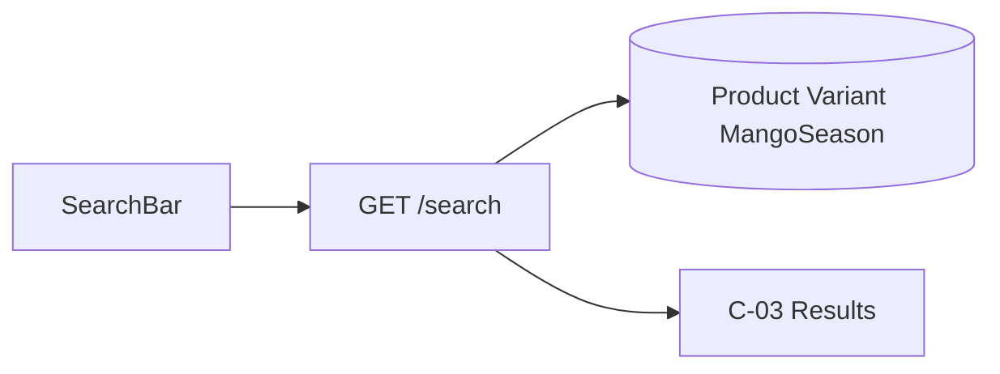

# Search

Dedicated search spec. Screen wireframe: [C-03-search.md](C-03-search.md). API: `GET /api/v1/search` in [API.md](API.md). Chrome: SearchBar in [01-global-chrome.md](01-global-chrome.md); Android search icon in [AN-03-bottom-nav.md](AN-03-bottom-nav.md).

Search is **not** a stored catalog object. The query is `search_query` (`q` in the API). Results are Product + default Variant, same cards as category listing.

---

## 1. Purpose

Let a guest or customer find exotic fruits, dry fruits, and mango varieties by typing a name, origin, or variety (e.g. Alphonso, Mamra, Ratnagiri).

---

## 2. Where search lives

| Surface | Control | After submit |
| --- | --- | --- |
| Website header | SearchBar | `/search?q=` → C-03 |
| Website C-03 | SearchBar still in header (query kept) | Same page, new `q` |
| Android toolbar | Search icon → search screen | Same C-03 layout; `GET /search` |
| Admin | Product list `search` on A-03 | `GET /admin/products?search=` (name/SKU) — staff only, not this file |

---

## 3. Query object (not in DB)

| Field | Object | Control | Required | Validation |
| --- | --- | --- | --- | --- |
| q / search_query | SearchQuery | text | yes to run search | Trim; 1–80 chars; empty submit does nothing |
| category | Product | filter | no | exotic / dry_fruit / mango |
| origin | Product | filter | no | |
| pack_type | Variant | filter | no | weight / box / tin |
| season_status | Product | filter | no | |
| sort | — | dropdown | no | featured / price_asc / price_desc / name |
| page | — | pagination | no | ≥ 1 |

---

## 4. What is searched (backend)

Match **active** products only (`is_active=true`).

| Field | Object | Match |
| --- | --- | --- |
| name | Product | Partial, case-insensitive |
| origin | Product | Partial, case-insensitive |
| variety_name | MangoSeason | If linked Product; partial |
| short_description | Product | Optional in MVP; name+origin+variety is Must |

Do **not** search: SKU (shop), customer data, admin-only drafts.

Ranking MVP: better name match first, then origin, then featured/manual order. Exact implementation (Postgres `ILIKE` vs search engine) is not fixed.

---

## 5. API

```
GET /api/v1/search?q={search_query}&category=&origin=&pack_type=&season_status=&sort=&page=
```

Public. Response: same page shape as `GET /products` — `{ items, total, page, page_size }` where each item is Product + `default_variant`.

| HTTP | When |
| --- | --- |
| 200 | Hits or zero hits (`items: []`) |
| 400 | `q` missing, empty, or longer than 80 |

Zero hits is **200**, not 404. Client shows C-03 empty state.

---

## 6. Screen (C-03) — objects and fields

Full wireframe: [C-03-search.md](C-03-search.md).

**Objects:** SearchSummary, FilterBar, ProductGrid, ProductCard, EmptySearch.

**Result card fields:** Product `name`, `slug`, `origin`, `category`, `season_status`, `images[0]`; Variant `price`, `pack_label`.

**Actions:** tap card → C-04; new query → C-03; clear → C-01 (web) or Home tab (Android).

**Empty:** “No fruits match '{query}'.” Tiles to Exotic / Dry fruits / Mangoes (C-02 / C-05).

---

## 7. Architecture



Search runs on the **API**, not only in the browser. Android and website must show the same hits for the same `q`.
