# Grove & Stone — project output

User-supplied screenshots of the website in an iPhone browser, added on 13 September 2026. These are unchanged captures of the screens at the time they were taken. They show the interface, including sample harvest labels and the ordering-availability notice; they are not evidence of completed live payments or delivery fulfilment.

[Open the live website](https://grove-and-stone-web.onrender.com/) · [Back to project README](../README.md)

## Screenshots

Click a preview to open the original-size image. Filenames follow the shopping flow: Home → Mangoes → Cart → Account.

| Screen | Preview |
| --- | --- |
| Home: animated fruit hero | <a href="screenshots/01-home-hero.jpeg">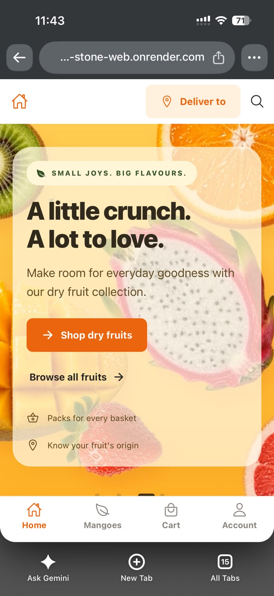</a> |
| Home: delivery check and categories | <a href="screenshots/02-home-categories.jpeg">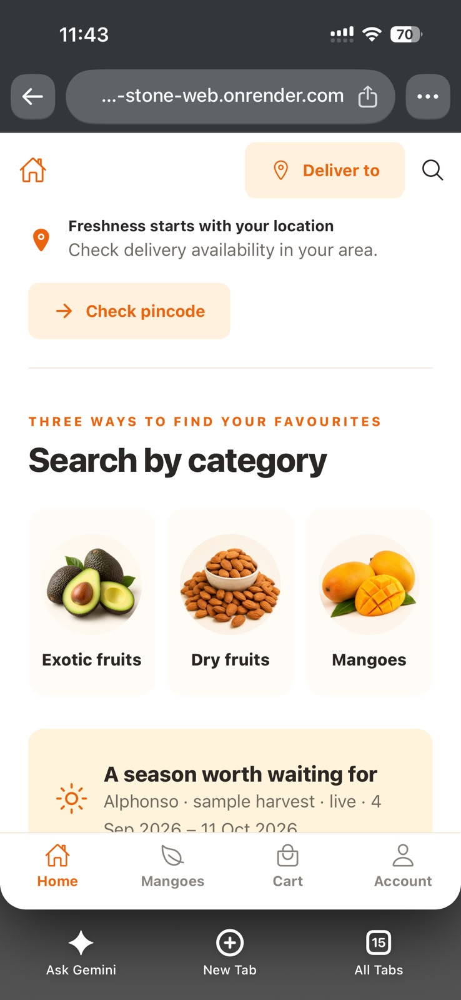</a> |
| Home: product catalog and stock updates | <a href="screenshots/03-home-catalog.jpeg">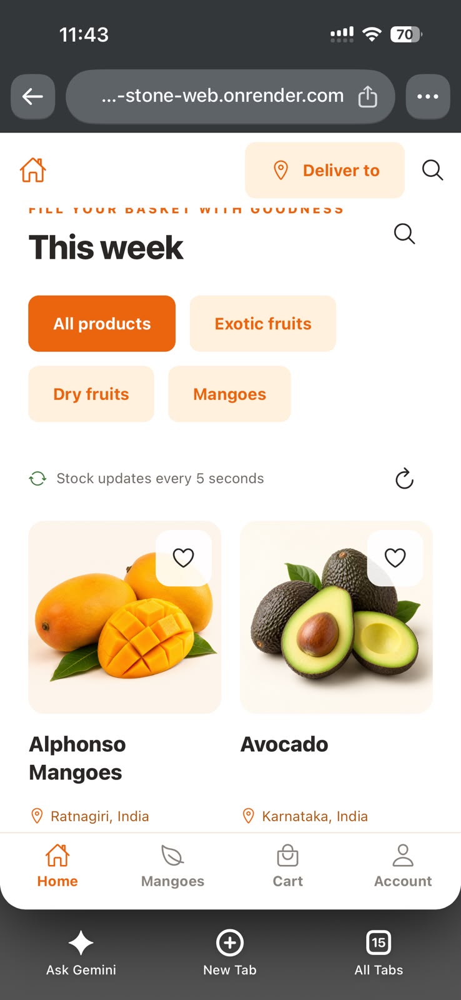</a> |
| Home: how shopping works | <a href="screenshots/04-how-it-works.jpeg">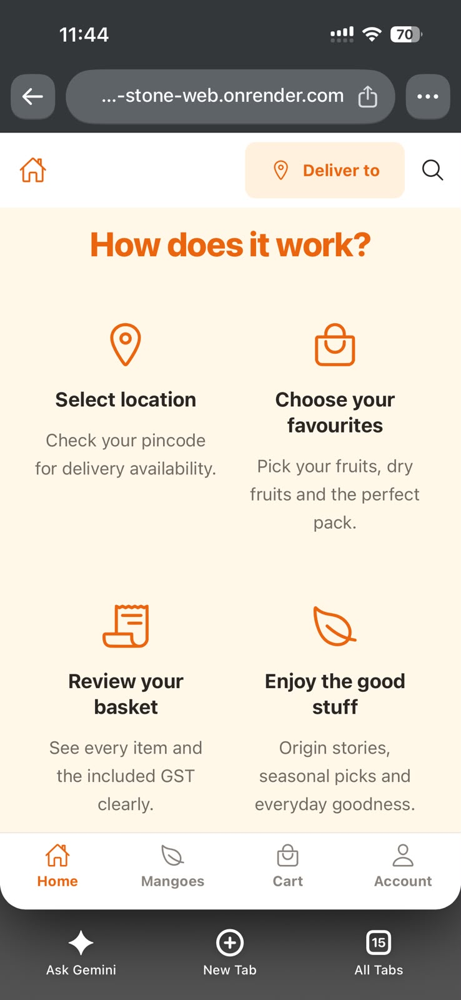</a> |
| Home: footer and information links | <a href="screenshots/05-home-footer.jpeg">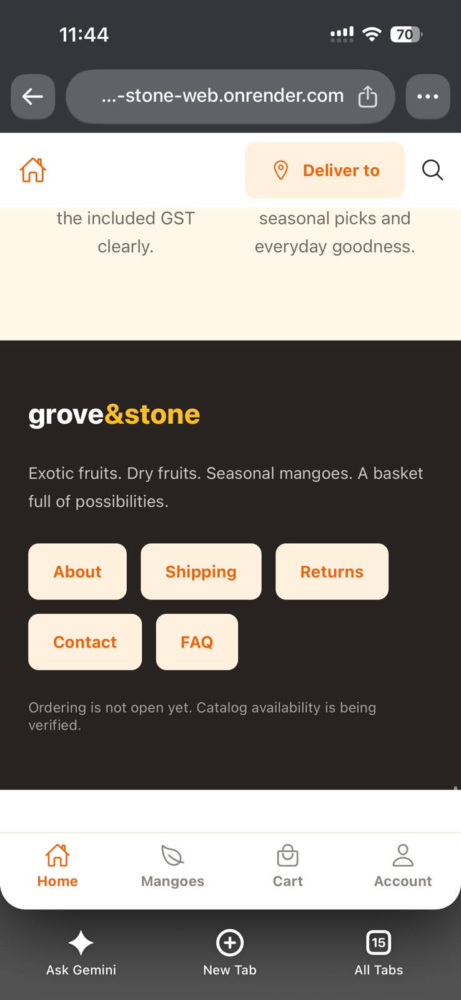</a> |
| Mangoes: seasonal collection | <a href="screenshots/06-mango-season.jpeg">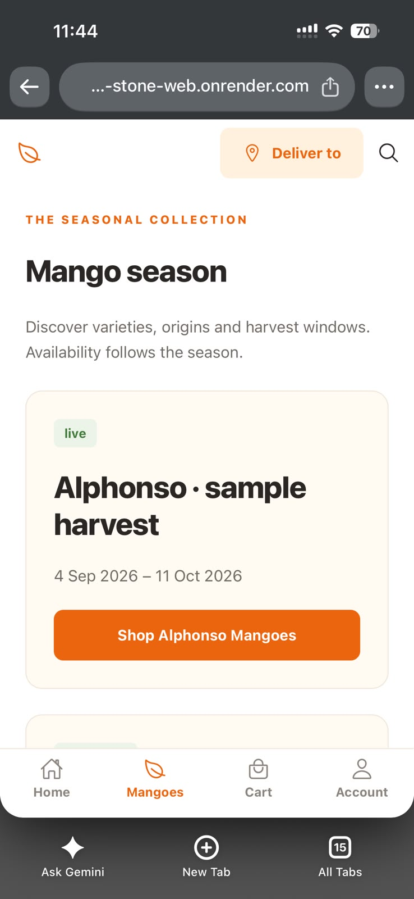</a> |
| Mangoes: upcoming harvest and notification signup | <a href="screenshots/07-mango-waitlist.jpeg">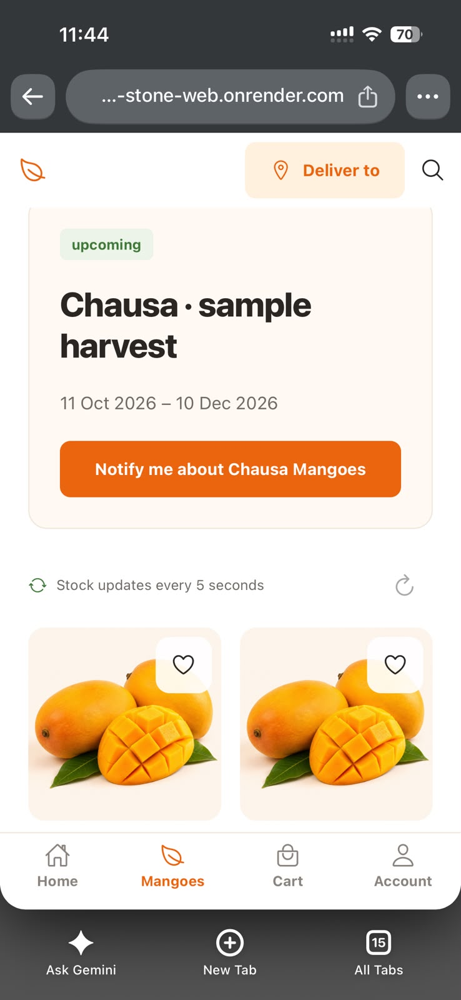</a> |
| Cart: product, quantity and price | <a href="screenshots/08-cart-items.jpeg">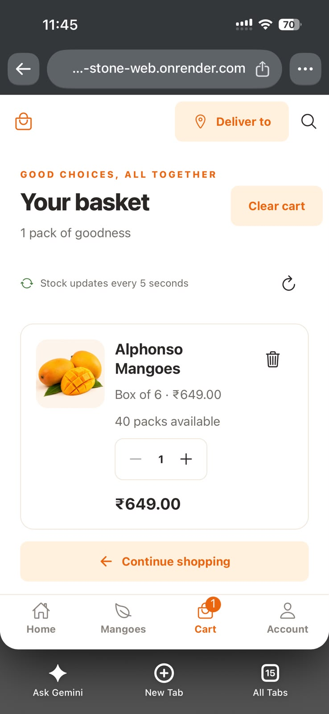</a> |
| Cart: totals, GST and checkout entry | <a href="screenshots/09-cart-summary.jpeg">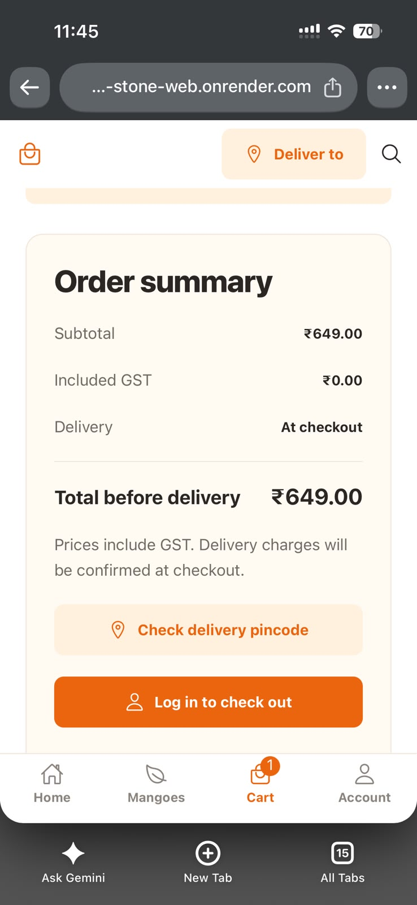</a> |
| Account: wishlist, orders and reorder introduction | <a href="screenshots/10-account-overview.jpeg">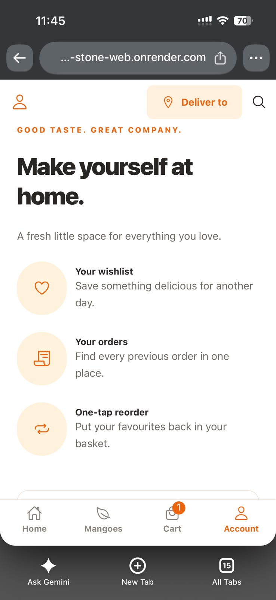</a> |
| Account: login and create-account entry | <a href="screenshots/11-account-login.jpeg">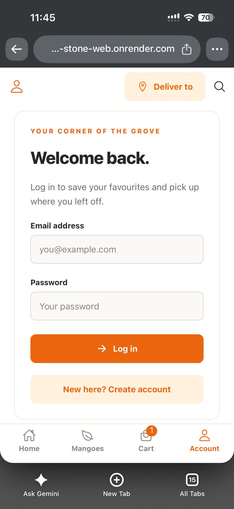</a> |

Original filenames and SHA-256 checksums are listed in [the screenshot manifest](screenshots/manifest.json).
