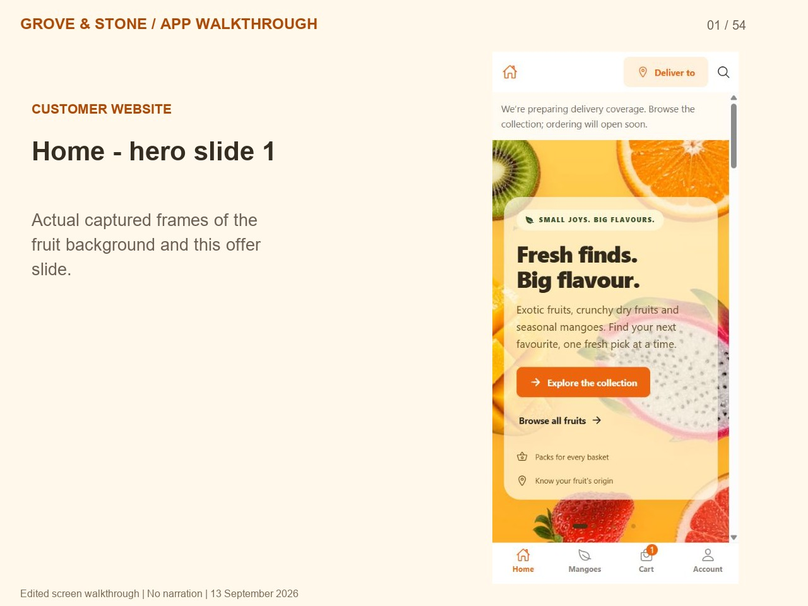

# Grove & Stone — app walkthrough

[Watch or download the MP4](grove-and-stone-app-walkthrough.mp4)

This is an **edited walkthrough assembled from actual browser screen captures**, not a continuous screen recording. It has chapter captions and no narration. All four hero slides are included. The customer segment shows the deployed website; the owner dashboard segment shows the local demo using synthetic data. No real order, payment, signup or customer message was submitted during capture.

Signed-in customer profile/wishlist/order actions, checkout completion, live payment processing, real email delivery and courier fulfilment are **not demonstrated**. The local Expo preview command was blocked by automatic approval review, so a local customer checkout demonstration could not be recorded. Screens with sample catalog/harvest data retain their visible labels. See [the owner guide](../../OWNER_GUIDE.md) for launch requirements.

Captured 13 September 2026. Format: H.264 MP4, 1280 × 960, 24 fps output; source captures were sampled and edited. Frames may be held longer for reading.

## Chapters

| Start | Screen |
| --- | --- |
| 00:00 | Introduction and recording scope |
| 00:09 | Home - hero slide 1 |
| 00:15 | Home - hero slide 2 |
| 00:21 | Home - hero slide 3 |
| 00:27 | Home - hero slide 4 |
| 00:33 | Home - delivery location and category shortcuts |
| 00:38 | Catalog - exotic fruit cards |
| 00:43 | Catalog - dry fruit collection |
| 00:48 | Catalog - mango collection and availability |
| 00:53 | Product details - Alphonso mangoes |
| 00:58 | Product - pack price, availability and handling |
| 01:03 | Product - switching to a larger pack |
| 01:08 | Cart - items, quantity controls and stock |
| 01:13 | Cart - GST, totals and checkout availability |
| 01:18 | Delivery - pincode and city search |
| 01:23 | Delivery - Vijayawada pincode matches |
| 01:28 | Account - wishlist, order history and reorder overview |
| 01:33 | Account - email and password login |
| 01:38 | Account - registration form (not submitted) |
| 01:43 | Mango season - live and upcoming harvests |
| 01:48 | Mango waitlist - notification signup (not submitted) |
| 01:53 | Search - finding a fruit by name |
| 01:58 | Home - footer and support links |
| 02:03 | Home - how shopping works |
| 02:08 | Information - About Grove and Stone |
| 02:13 | Information - Shipping |
| 02:18 | Information - Returns |
| 02:23 | Information - Contact |
| 02:28 | Information - FAQ |
| 02:33 | FAQ - When are mangoes available? |
| 02:38 | FAQ - Where do you deliver? |
| 02:43 | FAQ - Can I pay cash on delivery? |
| 02:48 | FAQ - Will my fruit be ripe? |
| 02:53 | FAQ - How should I store my order? |
| 02:58 | FAQ - Is GST added at checkout? |
| 03:03 | FAQ - Can I cancel or reorder? |
| 03:08 | Owner demo - sign-in |
| 03:13 | Owner demo - daily overview |
| 03:18 | Owner demo - Orders |
| 03:23 | Owner demo - Inventory |
| 03:28 | Owner demo - Order alerts |
| 03:33 | Owner demo - Products |
| 03:38 | Owner demo - Delivery areas |
| 03:43 | Owner demo - Postal directory |
| 03:48 | Owner demo - Home offers |
| 03:53 | Owner demo - Mango seasons |
| 03:58 | Owner demo - Refunds |
| 04:03 | Owner demo - Business setup |
| 04:08 | Owner demo - Team |
| 04:13 | Owner demo - Activity log |
| 04:18 | Owner demo - synthetic order and packing details |
| 04:23 | Owner demo - product editor |
| 04:28 | Owner demo - packs, prices, GST and stock |
| 04:33 | Owner demo - pincode configuration |
| 04:38 | Owner demo - importing approved coverage |
| 04:43 | Remaining flows and launch requirements |

Duration: **04:52**. [Back to output gallery](../README.md).
